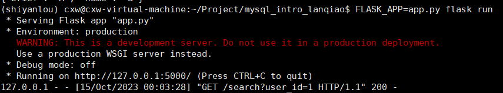
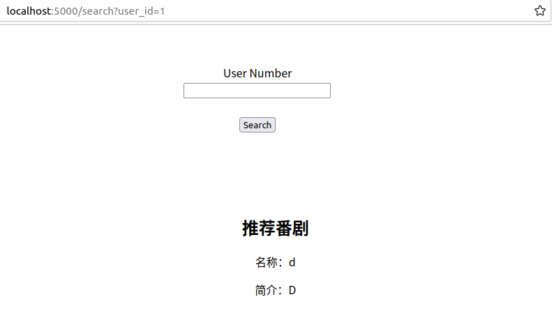

# MySql实战：基于 Flask 与 MySQL 实现番剧推荐系统

Tags: 中等
URL: https://www.lanqiao.cn/courses/633
source: 蓝桥云课

项目描述：该项目的主要目的是搭建一个简单的番剧推荐系统。

目的：主要学习MySql的应用，了解flask框架，并了解一些推荐系统的基本原理。

技术栈：MySql，flask，Python，virtualenv。

项目结构：

```bash
.
├── app.py
├── recommand.py
├── recommand.sql
└── templates
    ├── index.html
    └── search.html
```

项目通过在终端执行`FLASK_APP=app.py flask run`来执行得到：



使用浏览器访问 `localhost:5000`



# 0. 背景知识

### **Flask 框架**

Flask 是一个 Python 语言的微型网络开发框架。微框架中的 “微” 意味着 Flask 旨在保持核心简单而易于扩展。Flask 不会替你做出太多决策——比如使用何种数据库。而那些 Flask 所选择的——比如使用何种模板引擎则很容易替换。

Flask 基于 WerkzeugWSGI 工具箱和 Jinja2 模板引擎。实验中你将会利用 Jinja2 给予我们很大的方便，例如可以传递变量参数等。让我们的表示层动态的展示你想展示的信息

### **MySQL 和简单的 SQL 语句**

MySQL 作为一种关系型数据库，由于其体积小、速度快、总体拥有成本低，尤其是开放源码这一特点，一般中小型网站的开发都选择 MySQL 作为网站数据库。并且实验环境中已经安装好 MySQL，实验时可以直接使用。

我们要用到的 SQL 语句包括 select 语句、insert into 语句、create 语句、order by 子句， limit 限制语法等

# 1. 框架设计

## 1.1 创建MySQL数据库

由业务逻辑出发，我们需要创建以下几个数据表：

- user 用户表，存储用户名字
- anime 番剧表，存储番剧名字和简介
- anime_style 番剧 - 标签表，存储番剧及其对应的标签的 ID
- user_anime 用户 - 番剧表，记录用户已经看过并喜欢的番剧的 ID

# 2. 推荐算法

本节实验中我们实现的推荐算法比较简单，基本思路：

1. 找到用户所喜爱的番剧
2. 分析这些番剧的类别（一个番剧可能有多个标签），进行统计排序
3. 找到数量最多的前三个标签
4. 从数据库中找到同时具有这三个标签的番剧
5. 去掉已经看过的番剧后，从中随机选择一个
6. 将番剧相关信息（name，brief）进行展示

# 3. 推荐系统的实现与部署

接下来，我们将进行 Web 应用的编写。网站十分简单，仅提供两个页面：首页的查询页面和展示查询结果的页面，对应两个路由 `/` 和 `/search`

# 4. 后续改进

1. 增加数据量
2. 优化推荐算法
3. 完善网页，使其功能更全